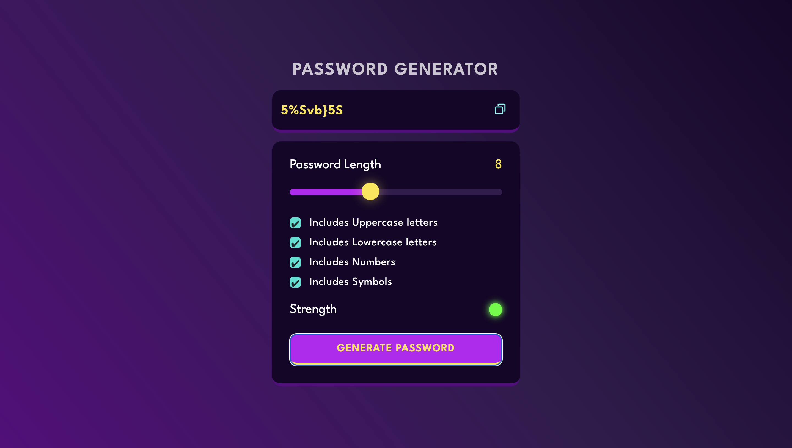

# Password Generator

A customizable and secure password generator web application built with HTML, CSS, and Vanilla JavaScript.



## Features

- **Custom Password Length**: Choose a password length between 1 and 20 characters using a slider.
- **Character Options**: Customize your password by including or excluding:
  - Uppercase letters
  - Lowercase letters
  - Numbers
  - Symbols
- **Strength Indicator**: Visually indicates the strength of your password based on its length and the complexity of the character types included.
- **Copy to Clipboard**: Easily copy your generated password with a single click.

## Technologies Used

- **HTML5**: For the structure and layout of the application.
- **CSS3**: For styling, layout, and visual presentation (uses the League Spartan font).
- **Vanilla JavaScript**: For the core logic, random character generation, and DOM manipulation.

## How to Run Locally

You can run this project locally without any complex setup. Simply follow these steps:

1. Clone or download the repository to your local machine.
2. Navigate to the project folder.
3. Open the `index.html` file in your preferred web browser.

Alternatively, you can serve it via a local development server like Python's `http.server` or Node's `http-server`:
```bash
# Using Python 3
python3 -m http.server 8081
```

Then visit `http://localhost:8081` in your browser.

## Project Structure

- `index.html`: Contains the core structure of the web page.
- `style.css`: Contains the styling for the application.
- `script.js`: Contains the logic for generating random passwords, updating the UI, determining password strength, and copying to clipboard.
